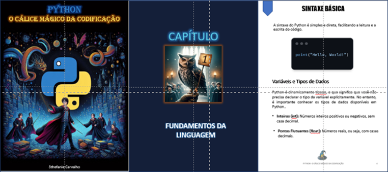

# Projeto EBOOK Gerado por I.A.s

Projeto com o objetivo de gerar um ebook digital com as facilidades das ferramentas de IA.

<a href="https://github.com/sthefaniecarvalho/prompts-ebook/blob/main/output/ebook-python.pdf" title="View PDF now"> 📕Clique aqui para ler</a>

## 💻 Tecnologias utilizadas no projeto

- [ChatGPT](https://chat.openai.com/) 
- [Copilot](https://www.bing.com/images/create)
- [PowerPoint](https://www.microsoft.com/en/microsoft-365/powerpoint)

## 🧠 Prompts

ChatGPT：

|   Ação   | Prompt                                                                                                                                                                                                                                                                         |
| :------: |----------------------------------------------------------------------- |
|  título  | Crie um título de um ebook sobre o tema Python, o ebook é do nicho de programação e o subnicho é python, o título deve ser épico e curto, e tenha uma temática de Harry Potter no título, me liste 5 variações de títulos                                                        |
| conteúdo | Faça um texto para ebook, sobre Python, listando os principais conceitos envolvendo o tema, com exemplos em código {REGRAS} - Explique sempre de uma maneira simples - Deixe o texto enxuto - Sempre traga exemplos de código em contextos reais - Sempre deixe um título sugestivo por tópico |

|  Ação  | Prompt                                                                                 |
| :----: | --------------------------------------------------------------------------- |
| capa |uma imagem combinando o universo do harry pottter com a linguagem python, use o simbolo de python |
| chapéu | um chapéu com o estilo do universo harry potter, com as cores azul e amarela que representam  o logo do python |
| capa capítulo | a coruja do harry potter segurando uma placa com o numero 1 |

## ✨ Features

- Conteúdo gerado via ChatGPT
- Imagens geradas via MidJourney

## 📚 Materiais

- Imagens utilizadas em `assets`
- ebook gerado durante as aulas em `output`

## 🛠️ Instruções de execução

Utilize os prompts acima nas ferramentas sugeridas para gerar o material base e utilize uma ferramenta de edição de documentos como power point, libreoffice , indesign para diagramação.

-----
